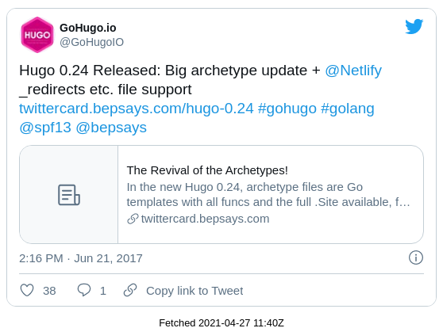

# static-social-posts
Embedding social posts in a privacy-preserving way -- using Hugo and Puppeteer

Sample at https://johnmu.com/tweet-screenshot-embeds/

Built on the [Hugo shortcodes](https://gohugo.io/content-management/shortcodes/#tweet) setup. 
Other platforms may vary, feel free to steal the idea.

# Setup

1. Copy all contents into your main Hugo folder. 
/code/ contains the scripts.

2. Install puppeteer in code

```
cd code
npm i puppeteer
```

3. Adjust `tweet_preprocess.sh` to match content & static directories

4. Run `tweet_preprocess.sh` to test

5. Add `code/tweet_preprocess.sh` to whatever you use to deploy.

# Usage

When writing posts, use the the following shortcodes to swap in the image-versions of tweets:

```



```

It works either by tweet ID or with the full URL (easier to copy & paste). 
After adding these to a post, you must preprocess the tweets before hosting with Hugo.

# What it does

1. Using grep, it finds all mentions of tweets
2. Any newly mentioned tweets are rendered locally using Puppeteer / Chrome, and saved as a screenshot
3. When Hugo runs, it swaps out mentions against an embedded image & link to the tweet. 

# Cons

* No responsive layout: small screens will get smaller text (image scaling rather than rewrapping)
* Currently English-only Twitter UI
* Twitter might not like embedding images (though I didn't spot anything in the TOS).
* When tweets are taken down, you have to manually remove the screenshot file if someone contacts you (or just empty the folder and rerun the script)

# To do

* Ditto for YouTube
* Ditto for Instagram
* Ditto for XYZ social network du jour

# Sample


