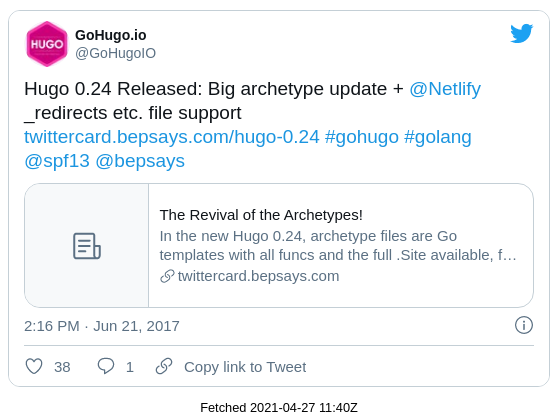
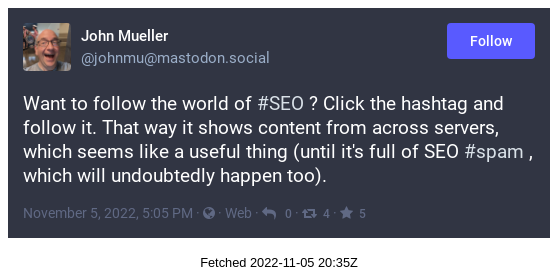

# static-social-posts
Embedding social posts in a privacy-preserving way -- using Hugo and Puppeteer. 

This code renders tweets locally and embeds them as a screenshot in your posts.
This means users don't need to load Twitter scripts when viewing your pages, making everything faster & more private.

It currently supports Twitter / tweets. 
I'll expand for the other kinds of content (videos, posts, whatever) when I have time. 

Sample at https://johnmu.com/tweet-screenshot-embeds/ (and below)

Built on the [Hugo shortcodes](https://gohugo.io/content-management/shortcodes/#tweet) setup. 
Other platforms may vary, feel free to steal the idea.

# Setup

1. Copy all contents into your main Hugo folder. 
/code/ contains the scripts.

1. Install puppeteer and html-to-text

```
cd code
npm i puppeteer html-to-text
```

3. Adjust `tweet_preprocess.sh` and `toot_preprocess.sh` to match content & static directories

4. Run `tweet_preprocess.sh` and `toot_preprocess.sh` to test

5. Add `code/tweet_preprocess.sh` and `code/toot_preprocess.sh` to whatever you use to deploy.

# Mastodon Usage

When writing posts, use the the following shortcode to swap in the image-versions of the post:

```

```

It works with the full URL of the post (easier to copy & paste).
Mastodon needs the full URL since posts are located on the user's server, not in a central repository.
After adding these to a post, you must preprocess the posts before hosting with Hugo.

Some Mastodon servers are quite slow. When creating the screenshot, Puppeteer waits until the embedded iframe of the post is resized, to try to capture the full content. There's a 20 second timeout should that not happen. The post includes a title-attribute for the image with a truncated version of the post's text.

# Twitter Usage

When writing posts, use the the following shortcodes to swap in the image-versions of tweets:

```



```

It works either by tweet ID or with the full URL (easier to copy & paste). 
After adding these to a post, you must preprocess the tweets before hosting with Hugo.

# What it does

1. Using grep, it finds all mentions of tweets / toots
2. Any newly mentioned posts are rendered locally using Puppeteer / Chrome, and saved as a screenshot (this takes a while initially)
3. When Hugo runs, it swaps out mentions against an embedded image & link to the post.

# Cons

* No responsive layout: small screens will get smaller text (image scaling rather than rewrapping)
* Currently English-only tweets and Mastodon server default language
* Twitter might not like embedding images (though I didn't spot anything in the TOS).
* When posts are taken down, you have to manually remove the screenshot file if someone contacts you (or just empty the folder and rerun the script)

# To do

* Ditto for YouTube
* Ditto for Instagram

# Sample

Twitter:



Mastodon:


